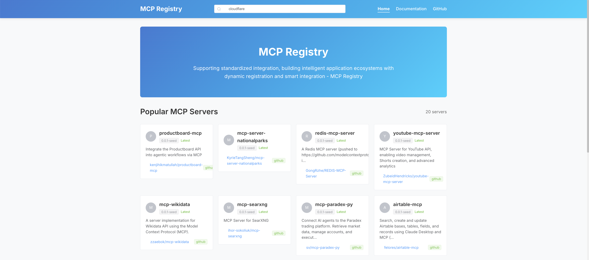
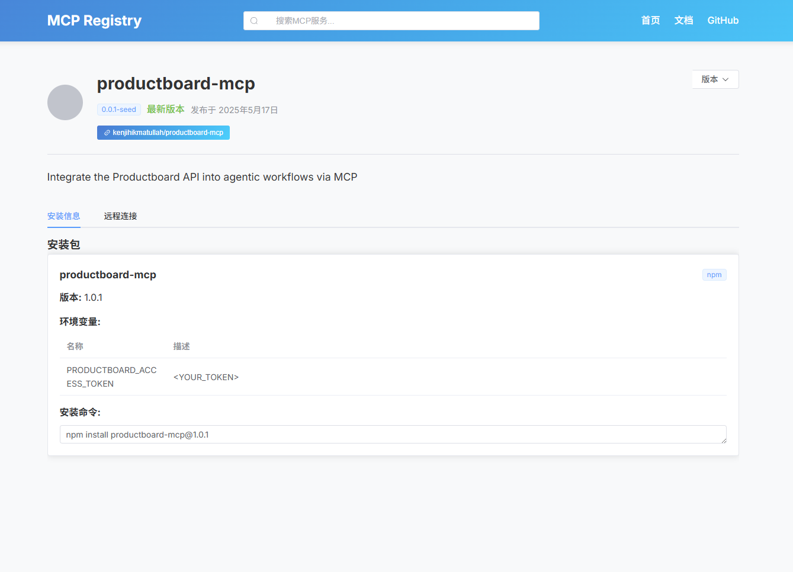
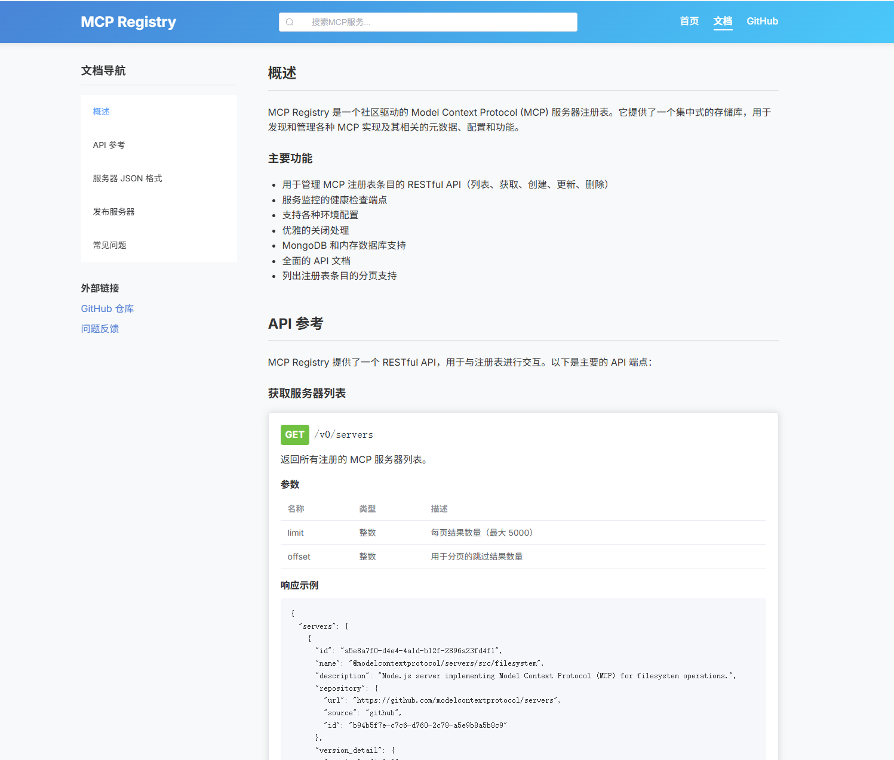

# 👋 mcp-registry-frontend

MCP Registry Frontend: A Vue 3 Application. This repository contains the frontend application for the MCP Registry project, built with Vue 3.



# 🚀 MCP Registry Frontend

This repository houses the **frontend application** for the **MCP Registry project**, built with **Vue 3**. It serves as the user interface for the open-source [mcp-registry](https://github.com/modelcontextprotocol/registry) backend.

-----

## Project Overview

The MCP Registry Frontend provides an intuitive and responsive interface for browsing, searching, and viewing details of registered servers within the Model Context Protocol ecosystem.

-----




## Key Features

  * **Server List Display**: View a comprehensive list of all registered servers.
  * **Server Detail Pages**: Dive into the specifics of each server with dedicated detail views.
  * **Search Functionality**: Easily find servers using the integrated search.
  * **Documentation Page**: Access relevant documentation directly within the application.
  * **Responsive Design**: Enjoy a seamless experience across various devices and screen sizes.

-----

## Project Structure

```
frontend/
├── public/               # Static assets
├── src/
│   ├── assets/           # Styles, images, and other assets
│   ├── components/       # Reusable Vue components
│   ├── router/           # Vue Router configuration
│   ├── services/         # API service definitions
│   ├── stores/           # Pinia state management modules
│   ├── views/            # Page-level components
│   ├── App.vue           # Root Vue component
│   └── main.js           # Application entry point
├── index.html            # Main HTML entry file
├── package.json          # Project dependencies and scripts
└── vite.config.js        # Vite build tool configuration
```

-----

## Getting Started

To get the project up and running locally, follow these steps:

### Installation

Clone the repository and install the necessary dependencies:

```bash
npm install
```

### Development Server

Start the development server with hot-reloading:

```bash
npm run dev
```

The application will typically be available at `http://localhost:5173`.

### Build for Production

Compile and minify the application for production deployment:

```bash
npm run build
```

The compiled assets will be placed in the `dist` directory.

### Preview Production Build

To test the production build locally:

```bash
npm run serve
```

-----

## Technology Stack

  * **Vue 3**: A progressive, incrementally adoptable JavaScript framework for building user interfaces.
  * **Vue Router**: The official routing library for Vue.js.
  * **Pinia**: A lightweight and intuitive state management library for Vue.js.
  * **Element Plus**: A popular Vue 3 UI component library for building rich web applications.
  * **Axios**: A promise-based HTTP client for making API requests.
  * **Vite**: A next-generation frontend tooling that provides an extremely fast development experience.

-----

## API Integration

The frontend communicates with the backend API via a `/api` proxy. In the development environment, API requests are automatically proxied to `http://localhost:8080/v0`.

-----

## Styling and Theming

The project uses **SCSS** for styling. You can customize the application's theme colors and variables in the `src/assets/styles/main.scss` file.
