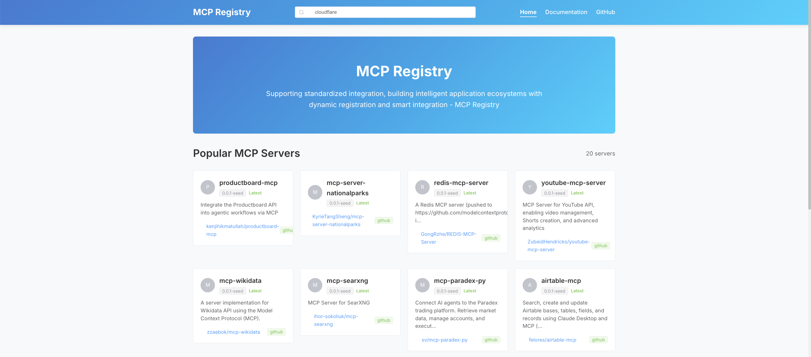
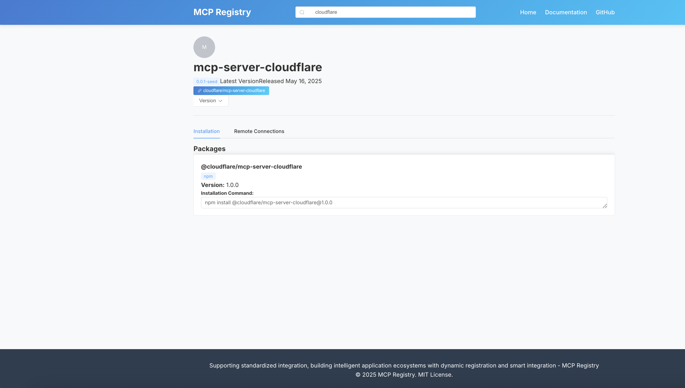
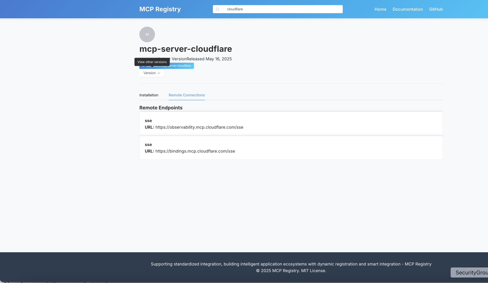

# 👋 MCP Registry 前端

这个仓库是 **MCP Registry 项目**的**前端应用**，使用 **Vue 3** 构建。它是开源项目 [mcp-registry](https://github.com/modelcontextprotocol/registry) 后端的**用户界面**。


-----

## 项目概览

MCP Registry 前端为浏览、搜索和查看 Model Context Protocol 生态系统中注册服务器的详细信息提供了一个直观且响应式的界面。

-----





## 主要功能

* **服务器列表展示**：查看所有已注册服务器的完整列表。
* **服务器详情页面**：通过专门的详情视图深入了解每个服务器的具体信息。
* **搜索功能**：使用集成的搜索功能轻松查找服务器。
* **文档页面**：直接在应用内访问相关文档。
* **响应式设计**：在各种设备和屏幕尺寸上享受无缝体验。

-----

## 项目结构

```
frontend/
├── public/               # 静态资源
├── src/
│   ├── assets/           # 样式、图片及其他资源
│   ├── components/       # 可复用 Vue 组件
│   ├── router/           # Vue Router 路由配置
│   ├── services/         # API 服务定义
│   ├── stores/           # Pinia 状态管理模块
│   ├── views/            # 页面级组件
│   ├── App.vue           # 根 Vue 组件
│   └── main.js           # 应用入口文件
├── index.html            # 主要 HTML 入口文件
├── package.json          # 项目依赖和脚本
└── vite.config.js        # Vite 构建工具配置
```

-----

## 快速开始

要让项目在本地运行起来，请按照以下步骤操作：

### 安装

克隆仓库并安装必要的依赖：

```bash
npm install
```

### 开发服务器

启动开发服务器，支持热重载：

```bash
npm run dev
```

应用程序通常会在 `http://localhost:5173` 上可用。

### 构建生产版本

为生产部署编译和压缩应用程序：

```bash
npm run build
```

编译后的资产将放置在 `dist` 目录中。

### 预览生产构建

在本地测试生产构建：

```bash
npm run serve
```

-----

## 技术栈

* **Vue 3**：一个渐进式 JavaScript 框架，用于构建用户界面。
* **Vue Router**：Vue.js 的官方路由库。
* **Pinia**：Vue.js 的轻量级且直观的状态管理库。
* **Element Plus**：一个流行的 Vue 3 UI 组件库，用于构建丰富的 Web 应用程序。
* **Axios**：一个基于 Promise 的 HTTP 客户端，用于发出 API 请求。
* **Vite**：下一代前端工具，提供极快的开发体验。

-----

## API 集成

前端通过 `/api` 代理与后端 API 通信。在开发环境中，API 请求会自动代理到 `http://localhost:8080/v0`。

-----

## 样式和主题

项目使用 **SCSS** 进行样式管理。您可以在 `src/assets/styles/main.scss` 文件中自定义应用程序的主题颜色和变量。